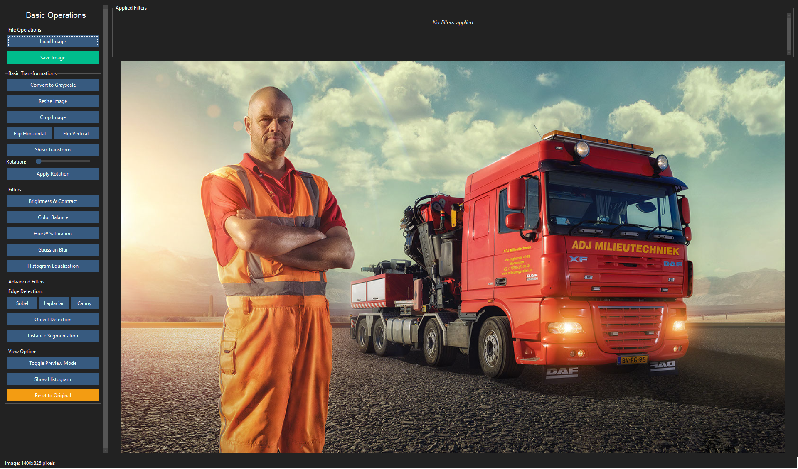
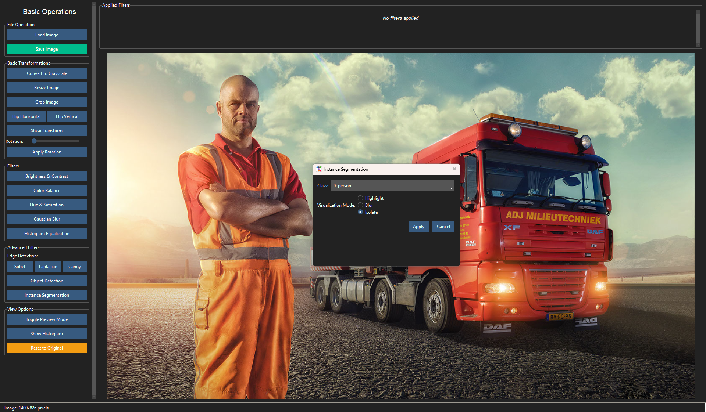
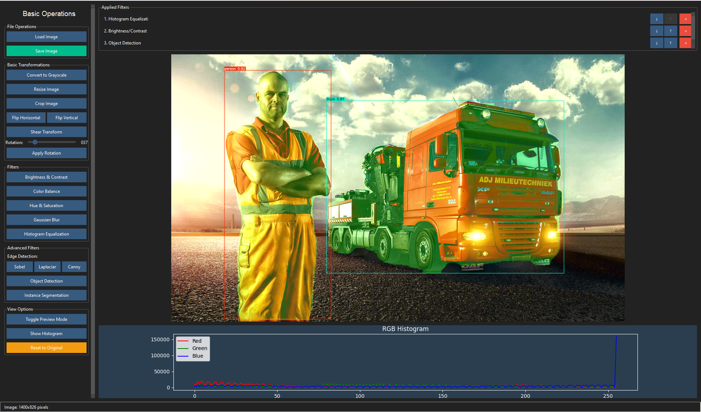

# Digital Image Processing Application

## Project Overview

This application is a modern, feature-rich image processing tool built with Python and tkinter/ttkbootstrap. It provides a user-friendly interface for applying various image processing techniques, from basic transformations to advanced computer vision features.

### Key Features

- **Basic Image Operations**: Loading, saving, resizing, cropping, flipping, and rotating images
- **Color Adjustments**: Brightness/contrast control, color balance, hue/saturation adjustments
- **Filters**: Gaussian blur, histogram equalization
- **Edge Detection**: Sobel, Laplacian, and Canny edge detection methods
- **Advanced Computer Vision**: Object detection and instance segmentation using YOLO models
- **Filter Stack**: Non-destructive editing with the ability to reorder, remove, or adjust filters
- **Real-time Preview**: Side-by-side comparison of original and processed images
- **Histogram Visualization**: RGB and grayscale histogram display

### Example Results

Here are some examples of image processing performed with this application:


*Original image loaded in the application*


*Example of image segmentation dialog*


*Example of multiple filters applied to an image*

## How to Run the Code

### Prerequisites

1. Python 3.8 or newer
2. Required Python packages:

```bash
pip install opencv-python numpy pillow ttkbootstrap ultralytics matplotlib
```

### Running the Application

1. Clone or download the project repository
2. Navigate to the project directory
3. Run the main script:

```bash
python main.py
```

### Usage

1. Load an image using the "Load Image" button
2. Apply various filters and transformations using the sidebar controls
3. View the filter stack in the top panel
4. Use the "Toggle Preview Mode" to compare original and processed images
5. Save the processed image using the "Save Image" button

## Techniques Used

### Image Transformation Techniques

- **Grayscale Conversion**: Converts color images to grayscale using OpenCV's `cvtColor` function
- **Resizing**: Scales images using specified width and height percentages
- **Cropping**: Extracts a region of interest from the image
- **Flipping**: Mirrors the image horizontally or vertically
- **Rotation**: Rotates the image by a specified angle using `getRotationMatrix2D` and `warpAffine`
- **Shear Transformation**: Applies shear transformation using affine matrices

### Color and Filter Operations

- **Brightness/Contrast Adjustment**: Enhances or reduces image brightness and contrast using `convertScaleAbs`
- **Color Balance**: Modifies individual RGB channel intensities
- **Hue/Saturation Adjustment**: Alters the HSV color space components
- **Gaussian Blur**: Applies Gaussian smoothing with adjustable kernel size
- **Histogram Equalization**: Enhances image contrast by normalizing intensity distribution

### Edge Detection Methods

- **Sobel Operator**: Detects edges by computing image gradients in x and y directions
- **Laplacian Operator**: Detects edges using the Laplacian second-order derivative
- **Canny Edge Detector**: Multi-stage algorithm for detecting edges with hysteresis thresholding

### Computer Vision Features

- **Object Detection**: Identifies and localizes objects in images using YOLOv8 (You Only Look Once)
- **Instance Segmentation**: Creates pixel-level masks of detected objects using YOLOv8-seg models
- **Various Masking Options**: Highlight, blur, or isolate detected objects

### Architecture Design

- **Filter Stack Pattern**: Non-destructive editing with reorderable operations
- **Preview Mode**: Side-by-side comparison capability
- **Event-Driven UI**: Responsive design with event handlers for user interactions
- **Error Handling**: Robust error management throughout the application

## Project Structure

- `main.py`: Entry point for the application
- `ImageProcessingApp.py`: Main application UI and event handling
- `ImageProcessor.py`: Core image processing functionality
- `FilterStack.py`: Filter management system
- `ImageDialogs.py`: Dialog windows for parameter input

## Dependencies

- **OpenCV**: Core image processing operations
- **NumPy**: Numerical operations on image arrays
- **PIL/Pillow**: Image display in tkinter
- **ttkbootstrap**: Modern UI styling for tkinter
- **Ultralytics YOLO**: Object detection and instance segmentation
- **Matplotlib**: Histogram visualization

## License

This project is for educational purposes as part of Digital Image Processing coursework at AAST.